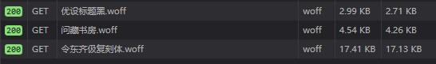
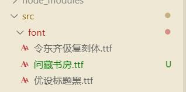
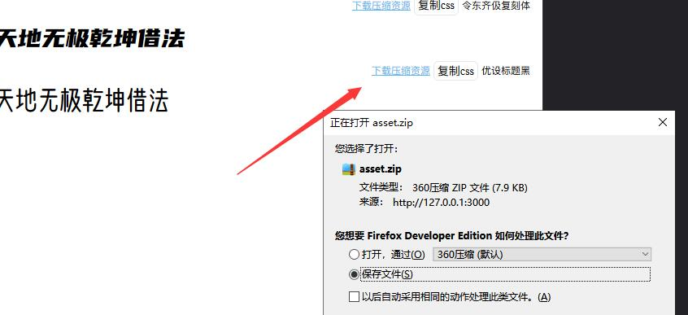

# web font 字体裁剪工具

## 起因

ui 需要展现一些特定的字体，但直接引入字体包又过大，于是想到了裁剪字体，一开始想的使用「字蛛」但他是针对静态网站的，而且实际他会多出许多英文的，估计是直接将源码中存在的文字都算进去了。
后来又找到阿里的「webfont」 但他的字体有限，项目又不开源，所以自己写了这个

## 目的与功能

1.裁剪字体包使其仅包含选中的字体

例如 如下图生成的字体包仅包含 「天地无极乾坤借法」


其体积自然十分之小



2.另外可以生成 css 直接复制可用，部署在公网便可永久访问

例如

```css
@font-face {
    font-family: "QIJIC";
    src: url("http://127.0.0.1:3000/asset/font/1584680576469/令东齐伋复刻体.eot"); /* IE9 */
    src: url("http://127.0.0.1:3000/asset/font/1584680576469/令东齐伋复刻体.eot?#iefix") format("embedded-opentype"), /* IE6-IE8 */
    url("http://127.0.0.1:3000/asset/font/1584680576469/令东齐伋复刻体.woff") format("woff"), /* chrome, firefox */
    url("http://127.0.0.1:3000/asset/font/1584680576469/令东齐伋复刻体.ttf") format("truetype"), /* chrome, firefox, opera, Safari, Android, iOS 4.2+ */
    url("http://127.0.0.1:3000/asset/font/1584680576469/令东齐伋复刻体.svg#QIJIC") format("svg"); /* iOS 4.1- */
    font-style: normal;
    font-weight: normal;
}
```

3.将 ttf 的字体包放置在 ./src/font/ 目录下自然可以检测到新的可用字体，无需重启服务



4.提供 zip 的整体下载方案




## 写项目时遇到的问题

使用 svelte https://github.com/DeMoorJasper/parcel-plugin-svelte 通过这个插件使用 parcel 然后报 new 的错 需要限制 编译的版本，在package.json browserslist 字段限制一下版本就好

## 启动

```bash
npm i
npm run build
npm run start
```

默认的访问地址是  http://127.0.0.1:3000

## 鸣谢

[字体天下](http://www.fonts.net.cn/commercial-free-32767/fonts-zh-1.html)

[fontmin](https://github.com/ecomfe/fontmin)

## License

MIT © [崮生](https://shenzilong.cn/关于/mit.html)