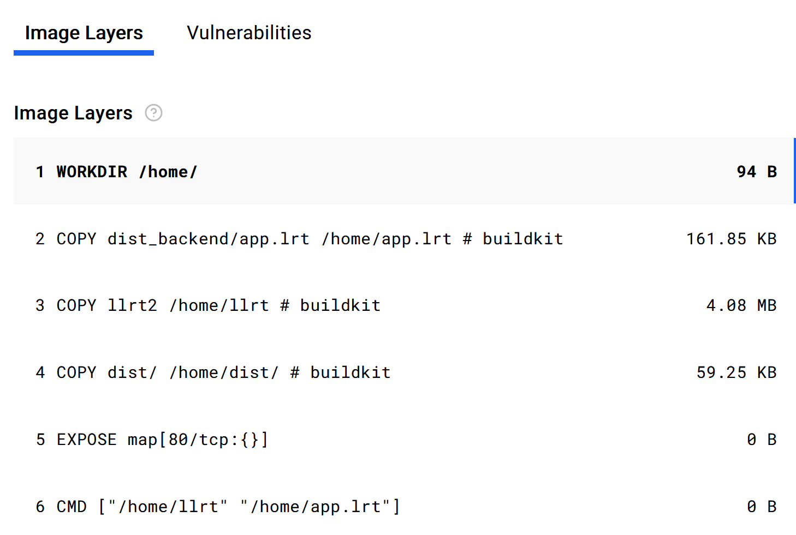

# web font 字体裁剪工具

之前的版本请查看 master 分支，为了能使用 llrt ，我进行了重写，之后只维护此分支


虽然 llrt 内存占用低，但它运行速度慢，不到node的1/2。有运行速度要求的建议使用node/bun运行

## 起因

ui 需要展现一些特定的字体，但直接引入字体包又过大，于是想到了裁剪字体，一开始想的使用「字蛛」但他是针对静态网站的，而且实际他会多出许多英文的，估计是直接将源码中存在的文字都算进去了。后来又找到阿里的「webfont」 但他的字体有限，项目又不开源，所以自己写了这个

## 在线尝试

- [web font 在线站点](https://webfont.shenzilong.cn/)

## 目的与功能

1.裁剪字体包使其仅包含选中的字体,其体积自然十分之小
2.另外可以生成 css 直接复制可用，部署在公网便可永久访问


## 安装与使用

### 使用 node / tjs / llrt 等运行时

拉取项目，并将字体文件放到项目内的 font 目录下，然后运行：

pnpm install && pnpm build && pnpm build_backend

node ./dist_backend/app.cjs
llrt ./dist_backend/app.cjs
tjs run ./dist_backend/app.cjs


### 使用 docker 安装

此镜像使用 llrt 运行时

https://hub.docker.com/repository/docker/llej0/web-font 很小的包体积 

docker compoose.yml

```yml
version: '3'
services:
  app:
    image: docker.io/llej0/web-font:latest
    ports:
      - "8087:8087"
    volumes:
      - ./data:/home/font # 挂载本机字体目录
    deploy:
      resources:
        limits:
          memory: 100M       # 设置内存限制为100MB，根据实际需求来设置
    restart: on-failure      # 设置重启策略为 on-failure

```

其中 font 目录替换成你的字体文件存放目录

## 提供的服务

## 鸣谢

[字体天下](http://www.fonts.net.cn/commercial-free-32767/fonts-zh-1.html)

[fontmin](https://github.com/ecomfe/fontmin)

## License

MIT © [崮生](https://shenzilong.cn/关于/mit.html)
